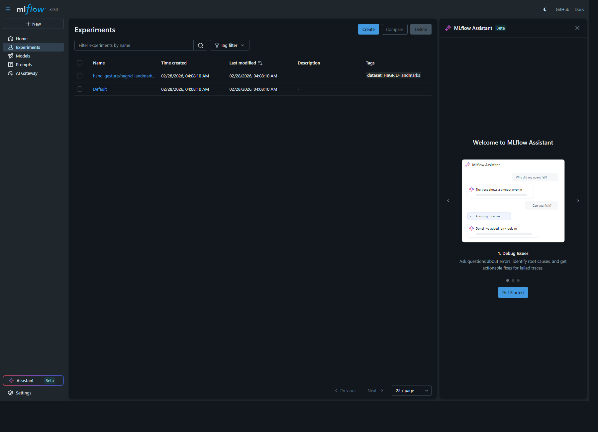
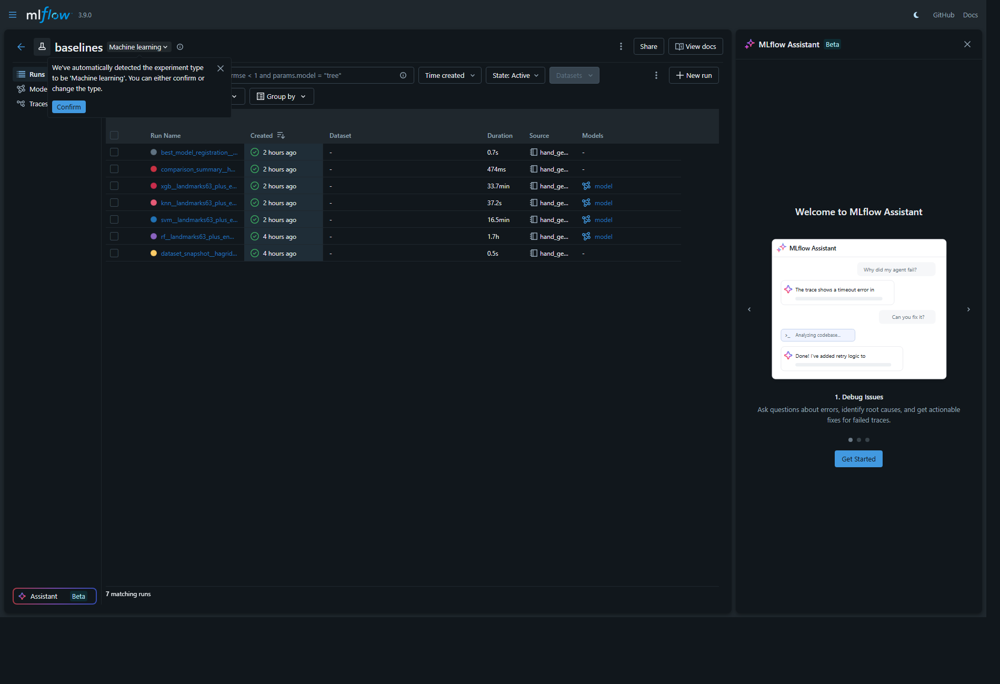
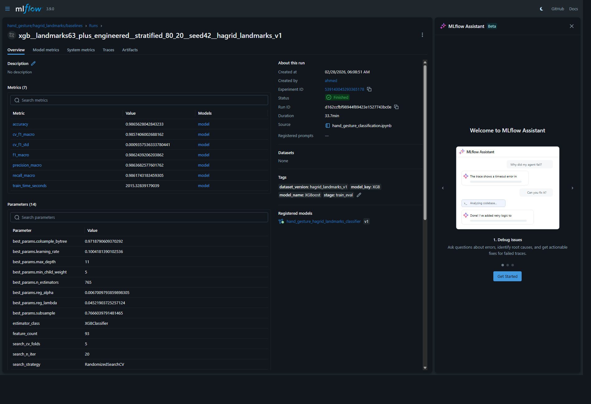
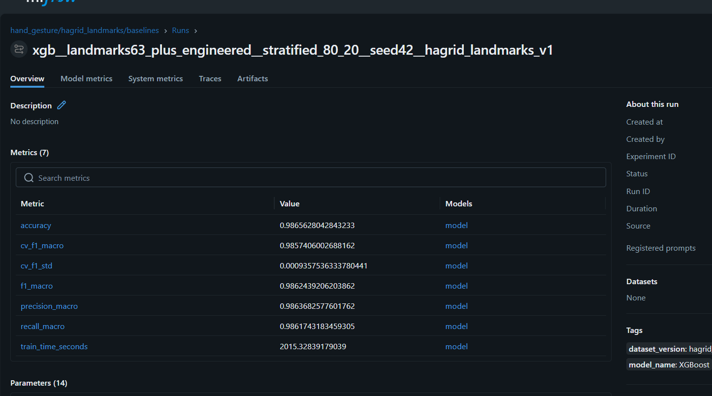
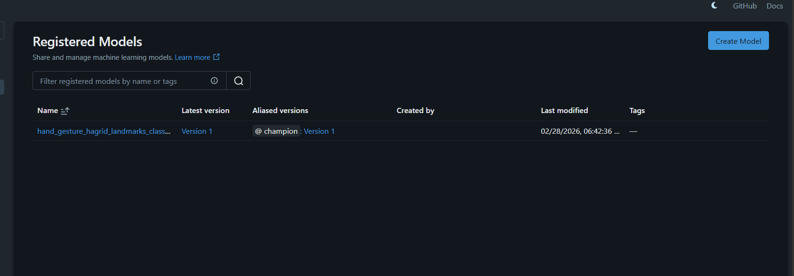

# MLflow UI Visibility Audit Report
UI visibility of experiments, tags, run logs, and registered models

## Executive Summary
- The active MLflow UI on port `5000` .
- In this store, tags and model logs are present, but not all are visible in list views by default.
- "Other logs/models" are in a different tracking store:.
- This is a data-store separation issue, not a training or logging failure.

## (Screenshots)
1. Experiments in active store (`fina_project`):
   - 
2. Baselines experiment run list (7 runs):
   - 
3. Run detail page showing tags + registered model link:
   - 
4. Registered Models list in active store:
   - 
5. Model version page showing version tags:
   - 

## report
- Experiment: `hand_gesture/hagrid_landmarks/baselines`
- Run count: 7
- Run-level tags exist (examples):
  - `stage=train_eval`
  - `dataset_version=hagrid_landmarks_v1`
  - `model_name=XGBoost`
- Registered model: `hand_gesture_hagrid_landmarks_classifier`
- Model version: `1` (alias: `champion`)
- Version tags exist (examples):
  - `selected_model_name=XGBoost`
  - `selection_metric=f1_macro`
  - `dataset_version=hagrid_landmarks_v1`

## Why Tags / Other Logs Were Not Obvious in UI
- MLflow list pages do not show every tag by default.
- Model-level `tags` are empty in this run set; useful metadata was logged at **model version tags** level.

## Non-Destructive Recommendations
1. use explicit backend URI when launching UI:
   - `mlflow ui --backend-store-uri "/mlruns" --port 5000`
2. In run table, add columns for:
   - `tags.stage`, `tags.dataset_version`, `tags.model_name`
3. In model pages, inspect **version tags** (not only top-level model tags).
4. If you want a single pane of glass, standardize on one store path moving forward.

## Deliverables
- Report file: `readme.md`file which is the report
- Screenshot bundle: `reports/*.png`
